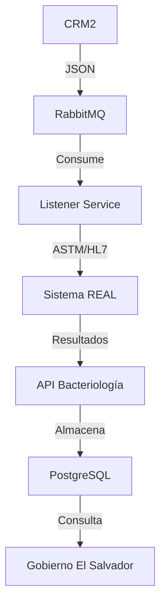

# Validación de Campos - Integración Sistema REAL

## Objetivo
Validar que todas las tablas y campos necesarios estén disponibles para la integración completa con el sistema REAL de bacteriología.

## Estado Actual de Tablas

### Tablas Existentes y Validadas
- **bacteria_catalogo_antibioticos** - 278 antibióticos de REAL
- **bacteria_catalogo_bacterias** - 7,429 microorganismos de REAL  
- **bacteria_catalogo_tipo_muestra** - Tipos 1-4 (copro, hemo, uro, secreciones)
- **bacteria_resultado_encabezado** - Resultados principales
- **bacteria_resultado_detalle** - Antibiograma (CMI + interpretación)
- **bacteria_tipo_resultado** - Códigos de resultado

## Campos Faltantes

### 1. Tabla de Mapeo Exámenes (CRÍTICA)
```sql
CREATE TABLE aux_examenes_real (
    id SERIAL PRIMARY KEY,
    examen_analiza_id VARCHAR(20) NOT NULL,
    examen_real_codigo VARCHAR(50) NOT NULL,
    examen_real_nombre VARCHAR(200) NOT NULL,
    activo BOOLEAN DEFAULT TRUE,
    fecha_mapeo TIMESTAMP DEFAULT NOW(),
    FOREIGN KEY (examen_analiza_id) REFERENCES core_examenes(ExamenId)
);
```

**Justificación:** REAL maneja exámenes generalizados vs Analiza específicos. Ejemplo:
- REAL: "CULTIVO MICOLÓGICO"  
- Analiza: "CULTIVO MICOLÓGICO DE UÑA", "CULTIVO MICOLÓGICO DE PIEL"

### 2. Campos Adicionales en bacteria_resultado_encabezado
```sql
ALTER TABLE bacteria_resultado_encabezado ADD COLUMN:
    equipo_vitek_id VARCHAR(50),
    real_session_id VARCHAR(100),
    astm_message_id VARCHAR(100),
    hl7_message_id VARCHAR(100),
    codigo_barra_muestra VARCHAR(15),
    metodo_identificacion VARCHAR(100),
    multiple_organismos BOOLEAN DEFAULT FALSE,
    organismo_principal_id INTEGER,
    organismos_secundarios JSONB,
    real_raw_data JSONB,
    estado_sincronizacion VARCHAR(20) DEFAULT 'PENDIENTE',
    fecha_envio_real TIMESTAMP,
    fecha_respuesta_real TIMESTAMP,
    error_real TEXT,
    version_real VARCHAR(20),
    operador_equipo VARCHAR(100),
    numero_corrida VARCHAR(50),
    control_calidad JSONB,
    comentarios_tecnicos TEXT,
    requiere_confirmacion BOOLEAN DEFAULT FALSE,
    confirmado_por VARCHAR(100),
    fecha_confirmacion TIMESTAMP;
```

### 3. Tabla para Múltiples Organismos
```sql
CREATE TABLE bacteria_resultado_organismos (
    id SERIAL PRIMARY KEY,
    encabezado_id INTEGER NOT NULL,
    organismo_id INTEGER NOT NULL,
    probabilidad_identificacion DOUBLE PRECISION,
    es_organismo_principal BOOLEAN DEFAULT FALSE,
    bionumero VARCHAR(50),
    comentarios TEXT,
    activo BOOLEAN DEFAULT TRUE,
    FOREIGN KEY (encabezado_id) REFERENCES bacteria_resultado_encabezado(id),
    FOREIGN KEY (organismo_id) REFERENCES bacteria_catalogo_bacterias(id)
);
```

**Justificación:** REAL puede enviar múltiples microorganismos por cultivo.

### 4. Trazabilidad de Mensajes ASTM/HL7
```sql
CREATE TABLE bacteria_mensajes_real (
    id SERIAL PRIMARY KEY,
    orden_numero VARCHAR(20) NOT NULL,
    tipo_mensaje VARCHAR(10) NOT NULL,
    direccion VARCHAR(10) NOT NULL,
    mensaje_completo TEXT NOT NULL,
    timestamp_mensaje TIMESTAMP DEFAULT NOW(),
    estado_procesamiento VARCHAR(20) DEFAULT 'PENDIENTE',
    error_procesamiento TEXT,
    reintentos INTEGER DEFAULT 0,
    procesado_por VARCHAR(100)
);
```

## Campos Validados Correctamente

### bacteria_resultado_detalle
- **cmi TEXT** -  Maneja valores concatenados ("<=0.12")
- **interpretacion TEXT** -  Valores S/I/R
- **antibiotico_id INTEGER** -  Mapea a catálogo

### Conversiones de Booleanos
- **blee TEXT** - Convierte TRUE/FALSE → "POSITIVO"/"NEGATIVO"
- **carbapenemasas TEXT** - Convierte TRUE/FALSE → "POSITIVO"/"NEGATIVO"

## Flujo de Integración Validado



## Campos Telemedicina

```sql
ALTER TABLE bacteria_resultado_encabezado ADD COLUMN:
    telemedicina_enviado BOOLEAN DEFAULT FALSE,
    telemedicina_fecha_envio TIMESTAMP,
    telemedicina_response JSONB,
    telemedicina_error TEXT,
    telemedicina_reintentos INTEGER DEFAULT 0;
```

## Consideraciones Técnicas

### Códigos de Barra
- **Usar:** `orden_tubo.codigo_barra` (VARCHAR 15)
- **No usar:** Campos BigInt en otras tablas

### Tipos de Muestra
- **Solo válidos:** IDs 1-4 del catálogo
- 1: Coprocultivo
- 2: Hemocultivo  
- 3: Urocultivo
- 4: Secreciones

### Actualización de Estados
```sql
-- Al insertar resultados, actualizar:
UPDATE core_tuboprueba 
SET prueba_finalizada = TRUE 
WHERE tubo_id = ? AND prueba_id = ?;
```

## Próximos Pasos

1. **Crear tabla aux_examenes_real** (Prioridad ALTA)
2. **Agregar campos faltantes a bacteria_resultado_encabezado**
3. **Crear tabla bacteria_resultado_organismos**
4. **Implementar tabla bacteria_mensajes_real**
5. **Validar campos telemedicina**
6. **Actualizar API para incluir nuevos campos**

## Checklist de Validación

- [ ] aux_examenes_real creada
- [ ] Campos REAL en bacteria_resultado_encabezado
- [ ] bacteria_resultado_organismos implementada
- [ ] bacteria_mensajes_real funcionando
- [ ] API actualizada con nuevos campos
- [ ] Pruebas de integración con REAL
- [ ] Validación flujo completo CRM2 → REAL → Gobierno