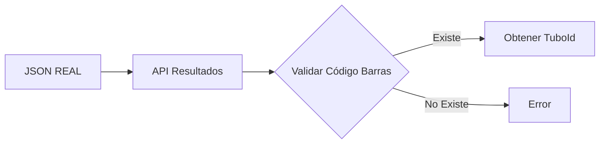

---
tags:
  - Analiza
---
Validación de estructuras de base de datos para integración con sistema REAL, específicamente las tablas de bacteriología y su relación con el JSON de resultados generado por Oned Gómez.

---

## Mapeo JSON → Tablas BD

### Estructura JSON de Entrada
```json
{
  "tubebarcode": "000103263997201",        
  "receptiondatetime": "2025-05-02 10:19:00",   
  "resultdatetime": "2025-05-02 10:18:03",      
  "conclusion": "CULTIVO POSITIVO",              
  "detail": {
    "microorganismid": "7",                      
    "antibiogram": [
      {
        "antibiotic": "149",                     
        "cmi": "0 0,12",                        
        "interpretation": "SENSIBLE"             
      }
    ]
  },
  "carbapenemasa": "POSITIVO",                  
  "blee": "NEGATIVO"                            
}
```

### Mapeo de Campos

| Campo JSON          | Tabla BD                        | Campo BD                    | Tipo        | Notas                 |
| ------------------- | ------------------------------- | --------------------------- | ----------- | --------------------- |
| `tubebarcode`       | `core_ordentubos`               | `TuboCodigoBarra`           | varchar(22) | 15 caracteres OK      |
| `receptiondatetime` | `bacteria_resultado_encabezado` | `fecha_recepcion`           | timestamp   | -                     |
| `resultdatetime`    | `bacteria_resultado_encabezado` | `fecha_registro_resultado`  | timestamp   | -                     |
| `conclusion`        | `bacteria_resultado_encabezado` | `conclusion`                | text        | -                     |
| `microorganismid`   | `bacteria_resultado_encabezado` | `organismo_seleccionado_id` | integer     | FK a catálogo         |
| `carbapenemasa`     | `bacteria_resultado_encabezado` | `carbapenemasas`            | text        | "POSITIVO"/"NEGATIVO" |
| `blee`              | `bacteria_resultado_encabezado` | `blee`                      | text        | "POSITIVO"/"NEGATIVO" |
| `antibiotic`        | `bacteria_resultado_detalle`    | `antibiotico_id`            | integer     | FK a catálogo         |
| `cmi`               | `bacteria_resultado_detalle`    | `cmi`                       | text        | Valores concatenados  |
| `interpretation`    | `bacteria_resultado_detalle`    | `interpretacion`            | text        | -                     |

---

## 🗄️ Estructuras de Tablas Validadas

### bacteria_resultado_encabezado
```sql
CREATE TABLE bacteria_resultado_encabezado (
    id                              INTEGER NOT NULL DEFAULT nextval(),
    orden_numero                    TEXT NULL,
    examen_id                       TEXT NULL,
    tubo_id                        BIGINT NULL,           -- FK a core_ordentubos.TuboId
    prueba_id                      BIGINT NULL,
    fecha_recepcion                TIMESTAMP NULL,         -- ← receptiondatetime
    fecha_registro_resultado       TIMESTAMP NULL,         -- ← resultdatetime
    fecha_entrega                  TIMESTAMP NULL,
    organismo_seleccionado_id      INTEGER NULL,          -- ← microorganismid
    origin_muestra_id              INTEGER NULL,
    probabilidad_seleccion         DOUBLE PRECISION NULL,
    bionumero                      TEXT NULL,
    horas_tiempo_analisis_identificacion  DOUBLE PRECISION NULL,
    horas_tiempo_analisis_sensibilidad    DOUBLE PRECISION NULL,
    conclusion                     TEXT NULL,              -- ← conclusion
    usuario_registro               TEXT NULL,
    usuario_validacion             TEXT NULL,
    resultado_validado             BOOLEAN NULL,
    blee                          TEXT NULL,              -- ← blee
    carbapenemasas                TEXT NULL,              -- ← carbapenemasa
    enviado_telemedicina          BOOLEAN NULL,
    organismo_tipo_aero           TEXT NULL
);
```

### bacteria_resultado_detalle
```sql
CREATE TABLE bacteria_resultado_detalle (
    id                INTEGER NOT NULL DEFAULT nextval(),
    encabezado_id     INTEGER NOT NULL,    -- FK a bacteria_resultado_encabezado
    antibiotico_id    INTEGER NOT NULL,    -- ← antibiotic
    cmi               TEXT NOT NULL,        -- ← cmi
    interpretacion    TEXT NOT NULL         -- ← interpretation
);
```

### core_tuboprueba (Campo Crítico)
```sql
CREATE TABLE core_tuboprueba (
    TuboExamenId                INTEGER NOT NULL DEFAULT nextval(),
    PruebaAnalizada            BOOLEAN NOT NULL,
    PruebaFinalizada           BOOLEAN NOT NULL,        -- ⚡ INDICADOR DE RESULTADO INGRESADO
    PruebaFechaHoraEnviaDato   TIMESTAMP WITH TIME ZONE NULL,
    PruebaResultado            BYTEA NULL,
    PruebaId                   INTEGER NULL,
    TuboId                     INTEGER NULL,            -- FK a core_ordentubos
    ExamenId                   CHARACTER VARYING(20) NULL,
    PruebaResultadoTexto       BYTEA NULL,
    prueba_resultado_numero    NUMERIC NULL,
    prueba_resultado_texto     CHARACTER VARYING(250) NULL,
    prueba_registrada_automatico  BOOLEAN NULL,
    prueba_equipo_origin       TEXT NULL
);
```

---

## 🔍 Flujo de Procesamiento

### 1. Recepción del JSON


### 2. Query de Búsqueda
```sql
-- Obtener información del tubo
SELECT 
    ot.TuboId,
    ot.OrdenId,
    ot.TuboCodigoBarra,
    tp.PruebaId,
    tp.ExamenId
FROM core_ordentubos ot
INNER JOIN core_tuboprueba tp ON ot.TuboId = tp.TuboId
WHERE ot.TuboCodigoBarra = '000103263997201';
```

### 3. Inserción de Resultados
```sql
-- 1. Insertar encabezado
INSERT INTO bacteria_resultado_encabezado (
    tubo_id,
    fecha_recepcion,
    fecha_registro_resultado,
    organismo_seleccionado_id,
    conclusion,
    blee,
    carbapenemasas
) VALUES (
    :tubo_id,
    :receptiondatetime,
    :resultdatetime,
    :microorganismid,
    :conclusion,
    :blee,
    :carbapenemasa
) RETURNING id;

-- 2. Insertar detalles del antibiograma
INSERT INTO bacteria_resultado_detalle (
    encabezado_id,
    antibiotico_id,
    cmi,
    interpretacion
) VALUES 
    (:encabezado_id, 149, '0 0,12', 'SENSIBLE'),
    (:encabezado_id, 56, '0 0,12', 'SENSIBLE'),
    (:encabezado_id, 123, '<= 0,06', 'SENSIBLE'),
    (:encabezado_id, 104, '<= 0,5', 'SENSIBLE');
```

### 4. Actualización de Estado
```sql
-- CRÍTICO: Marcar prueba como finalizada
UPDATE core_tuboprueba 
SET 
    PruebaFinalizada = TRUE,
    PruebaFechaHoraEnviaDato = CURRENT_TIMESTAMP
WHERE TuboId = :tubo_id;
```

---

## ⚠️ Validaciones Requeridas

### 1. Catálogos

- [ ]  Verificar que `microorganismid` existe en `bacteria_catalogo_bacterias`
- [ ]  Verificar que todos los `antibiotic` IDs existen en `bacteria_catalogo_antibioticos`
- [ ]  Validar que el tipo de muestra corresponde a los permitidos (1-4)

### 2. Integridad de Datos

- [ ]  Código de barras debe ser exactamente 15 caracteres
- [ ]  Fechas deben ser válidas y `resultdatetime` >= `receptiondatetime`
- [ ]  Valores de CMI pueden contener caracteres especiales (`<=`, espacios)

### 3. Campos Faltantes

|Campo|Origen|Requerido|
|---|---|---|
|`orden_numero`|`core_ordenesexamenes.OrdenId`|Sí|
|`examen_id`|`core_tuboprueba.ExamenId`|Sí|
|`prueba_id`|`core_tuboprueba.PruebaId`|Sí|
|`usuario_registro`|Sistema/Token|Sí|

---

## 📊 Queries de Validación

### Verificar Catálogos
```sql
-- Validar microorganismo
SELECT COUNT(*) FROM bacteria_catalogo_bacterias 
WHERE id = 7 AND activo = true;

-- Validar antibióticos
SELECT id, antibiotico_nombre 
FROM bacteria_catalogo_antibioticos 
WHERE id IN (149, 56, 123, 104) AND activo = true;
```

### Verificar Estado Actual
```sql
-- Ver estado de pruebas pendientes
SELECT 
    ot.TuboCodigoBarra,
    tp.PruebaFinalizada,
    oe.OrdenId,
    oe.OrdenFecha
FROM core_tuboprueba tp
JOIN core_ordentubos ot ON tp.TuboId = ot.TuboId
JOIN core_ordenesexamenes oe ON ot.OrdenId = oe.OrdenId
WHERE tp.PruebaFinalizada = FALSE
ORDER BY oe.OrdenFecha DESC;
```


---

## Notas Adicionales

- Los valores booleanos del JSON ("POSITIVO"/"NEGATIVO") se guardan como texto, no como boolean
- El campo CMI permite valores concatenados con espacios y caracteres especiales
- La tabla `core_tuboprueba` es la tabla crítica para el tracking de resultados completados
- Confirmar con Natalia los catálogos necesarios de los 7,429 microorganismos disponibles

---